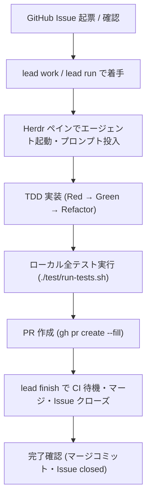

# lead セルフホスト開発手順 (Dogfooding Guide)

`lead` 自身の開発を `lead` で回す（dogfooding）ための開発フロー手順書です。

## 1. 前提環境と準備

`lead` が動作するために必要な依存ツールと認証状況を `lead doctor` で確認します。

```sh
# ローカルビルド & インストール
bin/install-local

# 環境診断（gh 認証、herdr、エージェント等の確認）
lead doctor
```

`doctor` で以下が揃っていることを確認してください：
- `gh auth`: GitHub CLI が認証済みであること
- `herdr`: マルチペイン環境 (`HERDR_ENV=1`) が利用可能であること
- `agents`: いずれかのコーディングエージェント（`agy`, `claude`, `codex`, `devin`, `opencode`, `gemini` 等）が検出されること

## 2. 開発フローの全体像



## 3. ステップ詳細

### Step 1: Issue 着手とワークフローの開始

対象の Issue 番号を指定して `lead run`（または互換コマンド `lead work`）を実行します。

```sh
# 通常の実装モード
lead run <Issue番号>

# Worktree を分離して作業する場合
lead run <Issue番号> --worktree

# レビューモード（未レビュー Issue の精緻化）
lead run <Issue番号> --mode review
```

- **Herdr 連携**: Herdr 環境下では、新しいサイドペインが分割され、エージェント起動コマンドと Issue から生成された TDD プロンプトが自動で準備されます。
- **インライン起動**: Herdr がない場合は、プロンプトと実行コマンドが標準出力に表示されます。

### Step 2: TDD 実装とローカルテスト

`AGENTS.md` の規定に従い、TDD で実装を進めます。

1. `test/` に失敗するテストを追加し、Red を確認する。
2. 最小限の実装を行い、Green を確認する。
3. リファクタリングを行い、テストがパスし続けることを確認する。
4. 全テストスイートを実行する：
   ```sh
   ./test/run-tests.sh
   ```

### Step 3: PR の作成

作業ブランチから `main` をターゲットにして PR を作成します。

```sh
git push -u origin issue/<番号>-<slug>
gh pr create --base main --fill
```

### Step 4: `lead finish` による完了処理

`lead finish` コマンドで CI のチェックを待機し、マージと Issue のクローズを自動実行します。

```sh
lead finish <Issue番号> --pr <PR番号> --merge --close
```

- **CI 監視**: `bin/ci-wait` と同様に GitHub Actions の完了を待機します。
- **ポリシー判定**: ガードレール（重要規約ファイルの変更等）が検知された場合は安全のため一時停止します。
- **マージ & クローズ**: CI パス後に squash merge を行い、Issue を自動でクローズしてワークフロー状態を完了（completed）に更新します。

### Step 5: クリーンアップ

Worktree を使用した場合は、作業完了後にディレクトリと記録を整理します。

```sh
lead clean <Issue番号>
```

## 4. Inbox TUI との組み合わせ

日常的な開発では、サブコマンドなしで `lead` を起動する Inbox TUI（`docs/rfc-inbox-ux.md`）を活用できます。

- `a`: Issue を承認（`needs-review` → `ready`）
- `p`: 稼働中のエージェント画面を Herdr で覗き見（peek）
- `s`: 一言のアイデアから `lead say` で仕様エージェントに Issue を起票させる
- `lead dispatch`: `ready` ラベルの付いた Issue をヘッドレスエージェントに自動分散
